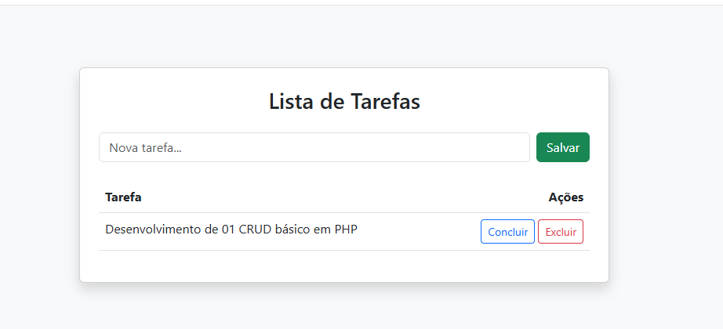

# 📝 Gerenciador de Tarefas Express - PHP CRUD

Este projeto é uma aplicação web didática desenvolvida para demonstrar a implementação completa de um sistema **CRUD** (Create, Read, Update, Delete) utilizando **PHP 8** e **MySQL**. 

A aplicação foi projetada com foco em **segurança (prevenção de SQL Injection)** e **didática**, sendo ideal para aulas de programação backend.




---

## 🚀 Funcionalidades

O projeto cobre as quatro operações fundamentais de persistência de dados:

*   **Create (Criar):** Adição de novas tarefas via formulário com validação.
*   **Read (Ler):** Listagem dinâmica de tarefas recuperadas do banco de dados.
*   **Update (Atualizar):** Alteração do status da tarefa (Pendente para Concluído) com feedback visual.
*   **Delete (Deletar):** Remoção definitiva de registros através da chave primária (ID).

## 🛡️ Destaques Técnicos

*   **Segurança com PDO:** Uso de *Prepared Statements* para neutralizar ataques de SQL Injection.
*   **Interface Responsiva:** Desenvolvida com **Bootstrap 5** para uma experiência de usuário moderna.
*   **Arquitetura Simples:** Lógica centralizada para facilitar o entendimento do fluxo de dados.
*   **Feedback Visual:** Utilização de classes dinâmicas CSS para indicar tarefas concluídas.

---

## 🛠️ Tecnologias Utilizadas

*   **Linguagem:** PHP 8.x
*   **Banco de Dados:** MySQL
*   **Frontend:** HTML5, CSS3, Bootstrap 5 (via CDN)
*   **Conexão:** Extensão PDO (PHP Data Objects)

---

## 📋 Como rodar o projeto

1. **Pré-requisitos:**
   - Ter um servidor local instalado (XAMPP, Laragon ou Wamp).

2. **Configuração do Banco de Dados:**
   - Acesse o `phpMyAdmin`.
   - Crie um banco de dados chamado `aula_php`.
   - Execute o seguinte SQL para criar a tabela:

   ```sql
   CREATE TABLE tarefas (
       id INT AUTO_INCREMENT PRIMARY KEY,
       descricao VARCHAR(255) NOT NULL,
       status ENUM('pendente', 'concluido') DEFAULT 'pendente'
   );
3. **Instalação da Aplicação:**
   - Clone este repositório para a pasta htdocs do seu servidor local.
   - Certifique-se de que o arquivo se chama index.php.

4. **Acesso:**
   - Abra o navegador e acesse: http://localhost/nome-da-sua-pasta/index.php.

## 🧑‍💻 Autor
Desenvolvido por Gabriel para fins didáticos e demonstração técnica.

